<p align="center">
  
  
  
  
  
</p>

<h1 align="center">🎮 gitpro</h1>
<p align="center">
  <strong>All-in-One GitHub Profile Suite</strong><br/>
  Level up your GitHub profile with 6 unique visualization modules!
</p>

<p align="center">
  <a href="./README.md">🇰🇷 한국어</a> •
  <strong>🇺🇸 English</strong>
</p>

<p align="center">
  <a href="#-features">Features</a> •
  <a href="#-modules">Modules</a> •
  <a href="#-quick-start">Quick Start</a> •
  <a href="#%EF%B8%8F-configuration">Configuration</a> •
  <a href="#-themes">Themes</a> •
  <a href="#-advanced-usage">Advanced Usage</a> •
  <a href="#-troubleshooting">Troubleshooting</a> •
  <a href="#-contributing">Contributing</a>
</p>

<p align="center">
  <a href="https://github.com/Sangyeonglee353/gitpro/fork">
    
  </a>
  &nbsp;
  <a href="https://github.com/Sangyeonglee353/gitpro">
    
  </a>
</p>

---

## ✨ Features

| | Feature | Description |
|---|---|---|
| 🎮 | **6 Unique Modules** | Trading Card, Code DNA, Chronicle, Code Pet, Constellation, Dev City |
| 🎨 | **11 Built-in Themes** | dark, light, cyberpunk, retro, pastel, ocean, forest, dracula, nord, sunset + custom |
| ⚡ | **Single YAML Config** | Manage all modules and themes with one `gitpro.config.yml` file |
| 🔄 | **GitHub Actions Automation** | Auto-runs every 6 hours, manual trigger supported |
| 📌 | **Gist Integration** | Upload SVGs to Pinned Gists for profile display |
| 🌍 | **Multi-language** | English (`en`), Korean (`ko`), Japanese (`ja`) |
| 💾 | **Persistent State** | Pet growth, city progression, chronicle data saved cumulatively |
| 🧩 | **Plugin Architecture** | Extend with custom modules via `GitProModule` interface |

---

## 🎯 Modules

### 🃏 Module 1: Dev Trading Card

Auto-generates your own **developer collectible card**, Pokémon/Yu-Gi-Oh! style.



- **Stat System** — ⚔ATK, 🛡DEF, 🧠INT, ⚡SPD auto-calculated from GitHub activity
- **Rarity System** — 🟤Common → 🟢Uncommon → 🔵Rare → 🟣Epic → 🟡Legendary
- **Special Abilities** — Midnight Surge (late-night commits), Polyglot (multi-language) auto-detected
- **Styles** — `hologram` | `pixel` | `minimal` | `anime`

### 🧬 Module 2: Code DNA

Analyzes commit patterns, language distribution, and coding hours to generate a **one-of-a-kind DNA fingerprint**.



- **Unique Seed** — Same data = same pattern (reproducible)
- **Coding Style Classification** — Nocturnal, Early Bird, Daytime, Balanced
- **Shapes** — `circular` | `helix` | `spiral` | `fingerprint`
- **Colors** — `language` | `mood` | `rainbow` | `monochrome`

### 📜 Module 3: Dev Chronicle

Transforms GitHub milestones into an **RPG-style quest log chronicle**.



- **Auto Chapter Generation** — First commit, first PR merge, new language learned, star milestones
- **Active Quests** — Detects ongoing challenges like 30-day commit streaks
- **Developer Titles** — Auto-assigned titles based on activity
- **Styles** — `rpg` | `book` | `timeline` | `comic`

### 🐾 Module 4: Code Pet

A **Tamagotchi-style virtual pet** that grows with your GitHub activity.


- **Language-based Pets** — TypeScript→🐲Dragon, Python→🐍Phoenix Snake, JavaScript→🐿️Squirrel, etc.
- **Evolution System** — 🥚Egg → 🐣Stage 1 → 🐥Stage 2 → 🐲Stage 3 → 👑Final Form
- **Mood & Hunger** — Pet sleeps or runs away with inactivity!
- **EXP Gain** — Commit(+10~30), PR Created(+50), PR Merged(+120), Star Received(+200)

### 🌌 Module 5: Commit Constellation

Converts repos into constellations, commits into stars, and PRs into meteors — a **night sky star map**.



- **Repo → Constellation** — Commits within a repo connected as constellation lines
- **Meteors (☄️)** — Merged PRs appear as shooting stars
- **Nebulae (✦)** — Open issues shown as glowing clouds
- **Sky Themes** — `midnight` | `aurora` | `sunset` | `deep_space`

### 🏙️ Module 6: Dev City

Transforms GitHub repositories into buildings — an **isometric pixel-art city**.



- **Building Types** — Frontend→🏬Mall, Backend→🏗️Factory, ML/AI→🔬Research Lab, etc.
- **City Tiers** — 🏕️Campsite → 🏘️Village → 🏙️Town → 🌆City → 🏙️Metropolis → 🌃Megacity
- **Live Weather** — ☀️Clear if 5+ commits today, 🌧️Rain if 3 days inactive
- **City Styles** — `pixel` | `isometric` | `flat` | `neon`

---

## 🚀 Quick Start

> 🌟 **If you like this project, please hit [⭐ Star](https://github.com/Sangyeonglee353/gitpro)!** It helps us build even better modules.

There are **2 ways** to display gitpro-generated SVGs on your profile:

| Method | Description | Best For |
|--------|-------------|----------|
| 📌 **[Method A: Pinned Gist](#method-a)** | Upload SVGs to a Gist and pin it to your profile | Those who don't want to touch their existing README |
| 📝 **[Method B: Add to Existing README](#method-b)** | Insert SVG image tags into your existing profile README | Those who want full control over their profile layout |

> 💡 You can use **both methods** simultaneously!

---

### Common Setup Steps

#### Step 1️⃣ — Fork & Repository Setup

1. Click the **⭐ Star** button at the top right of this repository!
2. Click **🍴 Fork** to fork the repo to your account

> ⚠️ You do **not** need to rename the forked repo. gitpro is used as a **separate SVG generation repo** and does not replace your existing profile README.

#### Step 2️⃣ — Create Personal Access Token

1. Go to [GitHub Settings → Developer settings → Personal access tokens (classic)](https://github.com/settings/tokens)
2. Click **Generate new token (classic)**
3. Select the following **scopes**:

| Scope | Required | Purpose |
|-------|----------|---------|
| `repo` | ✅ Required | Repo data access, profile README update (Method B) |
| `gist` | ✅ Required (Method A) | Upload SVGs to Gist |
| `read:user` | ✅ Required | Read user profile data |

4. Copy the generated token (⚠️ It's only shown once, so save it!)

#### Step 3️⃣ — Register Secret

Go to your forked repo's **Settings → Secrets and variables → Actions** and add the secret:

| Secret Name | Value |
|-------------|-------|
| `GH_TOKEN` | The Personal Access Token you copied above |

#### Step 4️⃣ — Edit Configuration

Edit the `gitpro.config.yml` file in your forked repo:

```yaml
# 🎮 gitpro Basic Settings
username: "your-github-username"    # ⭐ Change to your GitHub username!
timezone: "America/New_York"
locale: "en"                        # ko | en | ja
theme: "dark"                       # dark | light | cyberpunk | retro | pastel, etc.

# 🎯 Module Settings (set enabled: false for modules you don't want)
modules:
  trading-card:
    enabled: true
    style: "hologram"               # hologram | pixel | minimal | anime
    show_ability: true
    show_skills: true
    max_skills: 5

  code-dna:
    enabled: true
    shape: "circular"               # circular | helix | spiral | fingerprint
    color_scheme: "language"        # language | mood | rainbow | monochrome

  chronicle:
    enabled: true
    max_chapters: 8
    style: "rpg"                    # rpg | book | timeline | comic

  code-pet:
    enabled: true
    animation: true
    show_mood: true
    show_stats: true

  constellation:
    enabled: true
    sky_theme: "midnight"           # midnight | aurora | sunset | deep_space
    show_meteors: true

  dev-city:
    enabled: true
    city_style: "pixel"             # pixel | isometric | flat | neon
    show_weather: true
    animation: true
```

> 💡 **Tip**: Set `enabled: false` to disable a module. Use only the modules you need!

#### Step 5️⃣ — Verify GitHub Actions Workflow & Run

Your forked repo already includes `.github/workflows/gitpro.yml`.

> ⚠️ **Actions are disabled by default in forked repos.** After forking, go to the **Actions** tab and click **"I understand my workflows, go ahead and enable them"** to activate.

| Method | Description |
|--------|-------------|
| **Manual Run** | Forked repo → **Actions** tab → `gitpro - Update Profile` → **Run workflow** |
| **Auto Run** | Push config changes and Actions will trigger automatically |
| **Scheduled Run** | Runs automatically every 6 hours (cron) |

```bash
# Or push config changes to trigger auto-run
git add .
git commit -m "🎮 Configure gitpro for my profile"
git push origin main
```

> ✅ Once complete, SVG files will be generated in the `output/` directory. Now follow **Method A** or **Method B** below to apply them to your profile!

---

<a id="method-a"></a>

### Method A — 📌 Pinned Gist

> Display gitpro SVGs on your GitHub profile by **pinning a Gist** — no changes to your existing README needed.

**1. Create a Gist**

1. Go to [gist.github.com](https://gist.github.com) and create a **new Gist** (filename: `gitpro.md`, any content)
2. Copy the **Gist ID** from the URL
   - e.g., `https://gist.github.com/username/abc123def456` → `abc123def456`

**2. Add Gist Config to gitpro.config.yml**

```yaml
# 📌 Gist Integration Settings
gist:
  enabled: true
  gist_id: "abc123def456"                              # Your Gist ID
  modules: ["trading-card", "code-pet"]                 # Modules to upload (empty = all)
```

> ⚠️ Your GH_TOKEN must have the **gist** scope permission.

**3. Re-run Actions**

Push the config changes or manually re-run Actions to upload SVGs to your Gist.

**4. Pin the Gist to Your Profile**

1. Go to your GitHub profile page (`github.com/username`)
2. Click **"Customize your pins"**
3. Select the Gist you just created and **Pin** it

```
✅ Result: Profile visitors can see your gitpro SVGs right from your Pinned Gist!
```

---

<a id="method-b"></a>

### Method B — 📝 Add to Existing Profile README

> Insert gitpro SVG images directly into your existing profile README (`username/username`).

**1. Verify SVGs After Actions Run**

After gitpro Actions complete, SVG files are generated in the `output/` directory of your forked repo:

```
output/
├── trading-card.svg
├── code-dna.svg
├── chronicle.svg
├── code-pet.svg
├── constellation.svg
└── dev-city.svg
```

**2. Add Image Tags to Your Profile README**

In your profile repo (`username/username`) `README.md`, insert images using **absolute URLs** pointing to the forked gitpro repo's `output/` directory:

```markdown
<!-- 🎮 gitpro Modules -->
## 🎮 My Dev Stats

### 🃏 Trading Card


### 🧬 Code DNA


### 📜 Dev Chronicle


### 🐾 Code Pet


### 🌌 Commit Constellation


### 🏙️ Dev City

```

> 💡 Replace `{username}` with your GitHub username!

**3. Pick and Choose Your Favorite Modules**

You don't have to use all modules — just add the ones you like:

```markdown
<!-- Example: Trading Card and Code Pet only -->
<p>
  
  
</p>
```

> ✅ gitpro Actions auto-update SVGs every 6 hours, so your profile README always stays fresh — no manual updates needed!

---

### 📌 Overview of the Entire Flow

```
⭐ Star → 🍴 Fork → ✏️ Edit config → 🔑 Add Secret → ▶️ Run Actions
    ├── 📌 Method A: Upload to Gist → Pin to profile
    └── 📝 Method B: Add SVG image tags to profile README
```

---

## ⚙️ Configuration

### Global Settings

| Field | Type | Default | Required | Description |
|-------|------|---------|----------|-------------|
| `username` | `string` | — | ✅ | GitHub username |
| `timezone` | `string` | `"UTC"` | | Timezone (e.g., `Asia/Seoul`, `America/New_York`) |
| `locale` | `string` | `"en"` | | Language (`ko`, `en`, `ja`) |
| `theme` | `string` | `"dark"` | | Theme name (see [Themes](#-themes) section) |

### Module-Specific Settings

<details>
<summary>🃏 <strong>trading-card</strong> — Dev Trading Card</summary>

| Field | Type | Default | Description |
|-------|------|---------|-------------|
| `enabled` | `boolean` | `true` | Enable/disable module |
| `style` | `string` | `"hologram"` | Card style (`hologram`, `pixel`, `minimal`, `anime`) |
| `show_ability` | `boolean` | `true` | Show special abilities |
| `show_skills` | `boolean` | `true` | Show skills (languages) |
| `max_skills` | `number` | `5` | Max number of skills to display |
| `custom_title` | `string` | `""` | Custom title (auto-generated if empty) |

**Stat Calculation:**

| Stat | Basis |
|------|-------|
| ⚔ ATK (Attack) | Total commits + PR merge ratio |
| 🛡 DEF (Defense) | Issue resolution rate + code reviews |
| 🧠 INT (Intelligence) | Language diversity + star count |
| ⚡ SPD (Speed) | Avg PR turnaround time + commit frequency |

</details>

<details>
<summary>🧬 <strong>code-dna</strong> — Code DNA Fingerprint</summary>

| Field | Type | Default | Description |
|-------|------|---------|-------------|
| `enabled` | `boolean` | `true` | Enable/disable module |
| `shape` | `string` | `"circular"` | DNA shape (`circular`, `helix`, `spiral`, `fingerprint`) |
| `color_scheme` | `string` | `"language"` | Color scheme (`language`, `mood`, `rainbow`, `monochrome`) |
| `complexity` | `string` | `"detailed"` | Complexity (`simple`, `detailed`) |

</details>

<details>
<summary>📜 <strong>chronicle</strong> — Dev Chronicle</summary>

| Field | Type | Default | Description |
|-------|------|---------|-------------|
| `enabled` | `boolean` | `true` | Enable/disable module |
| `max_chapters` | `number` | `8` | Max number of chapters |
| `style` | `string` | `"rpg"` | Style (`rpg`, `book`, `timeline`, `comic`) |
| `language` | `string` | `"ko"` | Chronicle text language (`ko`, `en`) |

</details>

<details>
<summary>🐾 <strong>code-pet</strong> — Code Pet</summary>

| Field | Type | Default | Description |
|-------|------|---------|-------------|
| `enabled` | `boolean` | `true` | Enable/disable module |
| `custom_name` | `string` | `""` | Pet name (auto-generated if empty) |
| `show_mood` | `boolean` | `true` | Show mood status |
| `show_stats` | `boolean` | `true` | Show EXP/level stats |
| `animation` | `boolean` | `true` | Enable animation |

**Evolution System:**

| Stage | Required EXP | Form |
|-------|-------------|------|
| 🥚 Egg | 0 | Egg |
| 🐣 Stage 1 | 1,000 | Baby creature |
| 🐥 Stage 2 | 5,000 | Young creature |
| 🐲 Stage 3 | 15,000 | Adult |
| 👑 Final Form | 50,000 | Legendary form |

</details>

<details>
<summary>🌌 <strong>constellation</strong> — Commit Constellation</summary>

| Field | Type | Default | Description |
|-------|------|---------|-------------|
| `enabled` | `boolean` | `true` | Enable/disable module |
| `sky_theme` | `string` | `"midnight"` | Sky theme (`midnight`, `aurora`, `sunset`, `deep_space`) |
| `show_meteors` | `boolean` | `true` | Show meteors (merged PRs) |
| `show_nebula` | `boolean` | `true` | Show nebulae (open issues) |
| `max_constellations` | `number` | `10` | Max number of constellations |

</details>

<details>
<summary>🏙️ <strong>dev-city</strong> — Dev City</summary>

| Field | Type | Default | Description |
|-------|------|---------|-------------|
| `enabled` | `boolean` | `true` | Enable/disable module |
| `city_style` | `string` | `"pixel"` | City style (`pixel`, `isometric`, `flat`, `neon`) |
| `show_weather` | `boolean` | `true` | Show weather effects |
| `show_traffic` | `boolean` | `true` | Show traffic visualization |
| `animation` | `boolean` | `true` | Enable animation |

**City Tier Progression:**

| Tier | Requirement | City Name |
|------|-------------|-----------|
| 🏕️ Tier 0 | 1~2 repos | Campsite |
| 🏘️ Tier 1 | 3~5 repos | Village |
| 🏙️ Tier 2 | 6~10 repos | Town |
| 🌆 Tier 3 | 11~20 repos | City |
| 🏙️ Tier 4 | 21~40 repos | Metropolis |
| 🌃 Tier 5 | 41+ repos | Megacity |

</details>

### README Auto-generation Settings

```yaml
readme:
  auto_update: true                 # Auto-update README.md on each run
  layout: "grid"                    # grid: 2-column grid | vertical | tabs
  header:
    type: "wave"                    # wave | typing | gradient | none
    text: "Hello, I'm YourName! 👋"
    color: "#6C63FF"
  footer:
    enabled: true
    style: "minimal"                # wave | minimal | stats | none
    text: ""                        # Additional footer text (optional)
  module_order: []                  # Module display order (default order if empty)
  show_last_updated: true           # Show last updated timestamp
```

> 💡 List module IDs in `module_order` to arrange them in your preferred order:
> ```yaml
> module_order: ["trading-card", "code-pet", "code-dna", "constellation", "chronicle", "dev-city"]
> ```

---

## 🎨 Themes

11 built-in themes available:

| Theme | Description | Vibe |
|-------|-------------|------|
| `dark` | 🌙 Clean dark mode | **Default**, matches GitHub dark mode |
| `light` | ☀️ Bright light mode | Clean white background |
| `cyberpunk` | 🤖 Neon cyberpunk | Hot pink + cyan neon |
| `retro` | 🕹️ Retro gaming | Amber monitor vibes |
| `pastel` | 🎀 Soft pastel | Warm pastel tones |
| `ocean` | 🌊 Ocean blue | Deep sea blue palette |
| `forest` | 🌲 Forest green | Natural green palette |
| `dracula` | 🧛 Dracula | Popular Dracula theme |
| `nord` | ❄️ Nord | Nordic style |
| `sunset` | 🌅 Sunset | Sunset orange-purple |
| `custom` | 🎨 Custom | Define your own colors |

### Custom Theme Usage

Set `theme: "custom"` and define your colors in `custom_theme`:

```yaml
theme: "custom"
custom_theme:
  background: "#1a1b26"             # Main background color
  backgroundSecondary: "#24283b"    # Secondary background color
  text: "#c0caf5"                   # Main text color
  textSecondary: "#565f89"          # Secondary text color
  accent: "#7aa2f7"                 # Accent color
  accentSecondary: "#bb9af7"        # Secondary accent color
  border: "#3b4261"                 # Border color
```

---

## 🔧 Advanced Usage

### Gist Integration (Pinned Gist)

> 📌 For Gist integration setup, see [**Method A — Pinned Gist**](#method-a) in the Quick Start section above.

### Debug Mode

Enable detailed logging for troubleshooting:

```bash
# Local debug run
GITPRO_DEBUG=true GH_TOKEN=your_token npm start
```

In GitHub Actions, set as environment variable:
```yaml
- name: 🎮 Run gitpro (Debug)
  env:
    GH_TOKEN: ${{ secrets.GH_TOKEN }}
    GITPRO_DEBUG: "true"
  run: npm start
```

### Using Specific Modules Only

Disable unused modules with `enabled: false` to save execution time and API calls:

```yaml
modules:
  trading-card:
    enabled: true       # ✅ Use this one
  code-dna:
    enabled: false      # ❌ Disabled
  chronicle:
    enabled: false      # ❌ Disabled
  code-pet:
    enabled: true       # ✅ Use this one
  constellation:
    enabled: false      # ❌ Disabled
  dev-city:
    enabled: false      # ❌ Disabled
```

### README Markers

Content generated by gitpro is inserted between markers in your README.md:

```markdown
<!-- Write your custom content above -->

<!-- GITPRO:START -->
<!-- Content between these markers is auto-updated by gitpro -->
<!-- GITPRO:END -->

<!-- Write your custom content below -->
```

---

## 📂 Output Files

After Actions run, the following files are generated/updated in your forked repo:

```
gitpro/
├── output/                         # 📦 Generated SVG files
│   ├── trading-card.svg            # 🃏 Trading Card
│   ├── code-dna.svg                # 🧬 Code DNA
│   ├── chronicle.svg               # 📜 Chronicle
│   ├── code-pet.svg                # 🐾 Code Pet
│   ├── constellation.svg           # 🌌 Constellation
│   ├── dev-city.svg                # 🏙️ Dev City
│   └── header.svg                  # 🎨 Profile Header
└── state/
    └── gitpro-state.json           # 💾 Persistent state (pet EXP, city level, etc.)
```

> 💡 Display these SVGs on your profile using [**Method A (Gist Pin)**](#method-a) or [**Method B (Profile README)**](#method-b).

---

## 🏗️ Project Structure

```
gitpro/
├── src/
│   ├── index.ts                    # Main entry point
│   ├── types/index.ts              # Core type definitions
│   ├── core/
│   │   ├── config-loader.ts        # YAML config loader
│   │   ├── github-client.ts        # GitHub GraphQL/REST API client
│   │   ├── data-collector.ts       # GitHub data collector
│   │   ├── theme-manager.ts        # Theme color management
│   │   ├── state-manager.ts        # Persistent state management
│   │   ├── svg-engine.ts           # SVG builder engine
│   │   ├── module-runner.ts        # Module runner
│   │   ├── header-generator.ts     # Header SVG generation
│   │   ├── readme-generator.ts     # README auto-generation
│   │   └── gist-uploader.ts        # Gist uploader
│   └── modules/
│       ├── trading-card/           # 🃏 Trading Card module
│       ├── code-dna/               # 🧬 Code DNA module
│       ├── chronicle/              # 📜 Chronicle module
│       ├── code-pet/               # 🐾 Code Pet module
│       ├── constellation/          # 🌌 Constellation module
│       └── dev-city/               # 🏙️ Dev City module
├── tests/
│   ├── helpers/mock-data.ts        # Test mock data
│   ├── core/                       # Core module tests
│   └── modules/                    # Plugin module tests
├── state/                          # Persistent state storage
├── output/                         # Generated SVG files
├── gitpro.config.yml               # ⭐ User config file
├── action.yml                      # GitHub Action definition
├── package.json                    # Dependency management
└── tsconfig.json                   # TypeScript config
```

---

## 🧪 Local Development

```bash
# 1. Install dependencies
npm install

# 2. Build TypeScript
npm run build

# 3. Run (requires GH_TOKEN env var)
GH_TOKEN=your_token npm start

# 4. Development mode (direct ts-node execution)
GH_TOKEN=your_token npm run dev

# 5. Run tests
npm test

# 6. Run tests with coverage
npm run test:coverage

# 7. Watch mode tests
npm run test:watch

# 8. Lint
npm run lint

# 9. Clean build artifacts
npm run clean
```

---

## ❓ Troubleshooting

### Common Issues

<details>
<summary><strong>❌ "GitHub token is not set" error</strong></summary>

**Cause:** `GH_TOKEN` or `GITHUB_TOKEN` environment variable is not set

**Solution:**
1. Go to GitHub repo → **Settings** → **Secrets and variables** → **Actions**
2. Add your Personal Access Token as `GH_TOKEN`
3. Verify `env` in your workflow YAML includes `GH_TOKEN: ${{ secrets.GH_TOKEN }}`

</details>

<details>
<summary><strong>❌ "No active modules" warning</strong></summary>

**Cause:** All modules in `gitpro.config.yml` are set to `enabled: false`

**Solution:** Set at least one module to `enabled: true`.

</details>

<details>
<summary><strong>❌ GitHub API Rate Limit error</strong></summary>

**Cause:** GitHub API call limit exceeded (5,000/hour with authenticated token)

**Solution:**
1. Verify your Personal Access Token is properly configured
2. Disable unused modules in `gitpro.config.yml`
3. Reduce workflow frequency (e.g., `cron: '0 */12 * * *'` — every 12 hours)

</details>

<details>
<summary><strong>❌ SVGs not showing in GitHub README</strong></summary>

**Cause:** GitHub has security restrictions on external SVGs

**Solution:**
1. Verify SVG files are properly generated in the `output/` directory
2. Ensure `git add -A output/` is included in the workflow
3. Use relative paths for image references in README: ``

</details>

<details>
<summary><strong>❌ Pet/City state resets</strong></summary>

**Cause:** `state/gitpro-state.json` file is not being committed

**Solution:** Ensure the `state/` directory is included in the commit step of your workflow:
```yaml
git add -A output/ state/ README.md
```

</details>

---

## 🤝 Contributing

Contributions are welcome! **⭐ Star** and **🍴 Fork** are the greatest support.

### Bug Reports & Feature Requests

- Submit bug reports or feature requests at [Issues](https://github.com/Sangyeonglee353/gitpro/issues).

### Code Contributions

1. Give this repo a ⭐ **Star**
2. **🍴 Fork** the repo
3. Create a feature branch: `git checkout -b feature/amazing-feature`
4. Commit your changes: `git commit -m 'feat: Add amazing feature'`
5. Push the branch: `git push origin feature/amazing-feature`
6. Create a **Pull Request**

### Creating New Modules

Implement the `GitProModule` interface to easily add new modules:

```typescript
import { GitProModule, ModuleContext, ModuleOutput } from '../../types';

export class MyModule implements GitProModule {
  readonly id = 'my-module';
  readonly name = 'My Module';
  readonly description = 'My custom visualization module';
  readonly icon = '🚀';

  async generate(context: ModuleContext): Promise<ModuleOutput> {
    const { githubData, moduleConfig, theme } = context;

    // Write your SVG generation logic
    const svg = `<svg width="400" height="300">...</svg>`;
    const markdown = ``;

    return { svg, markdown };
  }
}
```

---

## 📄 License

This project is licensed under the [MIT License](LICENSE).

---

<p align="center">
  Made with ❤️ by <a href="https://github.com/Sangyeonglee353">Sangyeonglee353</a><br/>
  <sub>If this project helped you, please give it a ⭐ <strong>Star</strong>!</sub>
</p>

<!-- GITPRO:START -->
<!-- GITPRO:END -->
