<p align="center">
  
  
  
  
  
</p>

<h1 align="center">🎮 gitpro</h1>
<p align="center">
  <strong>All-in-One GitHub Profile Suite</strong><br/>
  6개의 독창적인 시각화 모듈로 당신의 GitHub 프로필을 꾸며보세요!
</p>

<p align="center">
  <strong>🇰🇷 한국어</strong> •
  <a href="./README.en.md">🇺🇸 English</a>
</p>

<p align="center">
  <a href="#-특징">특징</a> •
  <a href="#-모듈-소개">모듈 소개</a> •
  <a href="#-빠른-시작-가이드">빠른 시작</a> •
  <a href="#%EF%B8%8F-설정-가이드">설정 가이드</a> •
  <a href="#-테마">테마</a> •
  <a href="#-고급-사용법">고급 사용법</a> •
  <a href="#-트러블슈팅">트러블슈팅</a> •
  <a href="#-기여하기">기여하기</a>
</p>

<p align="center">
  <a href="https://github.com/Sangyeonglee353/gitpro/fork">
    
  </a>
  &nbsp;
  <a href="https://github.com/Sangyeonglee353/gitpro">
    
  </a>
</p>

---

## ✨ 특징

| | 기능 | 설명 |
|---|---|---|
| 🎮 | **6개의 독창적인 모듈** | 트레이딩 카드, 코드 DNA, 연대기, 코드 펫, 별자리, 개발자 도시 |
| 🎨 | **11가지 빌트인 테마** | dark, light, cyberpunk, retro, pastel, ocean, forest, dracula, nord, sunset + 커스텀 |
| ⚡ | **YAML 설정 하나로 제어** | `gitpro.config.yml` 파일 하나로 모든 모듈과 테마를 관리 |
| 🔄 | **GitHub Actions 자동화** | 6시간마다 자동 실행, 수동 실행도 지원 |
| 📌 | **Gist 연동** | Pinned Gist에 SVG를 업로드하여 프로필에 고정 |
| 🌍 | **다국어 지원** | 한국어 (`ko`), 영어 (`en`), 일본어 (`ja`) |
| 💾 | **영구 상태 관리** | 펫 성장, 도시 발전, 연대기 진행 등 데이터가 누적 저장 |
| 🧩 | **플러그인 아키텍처** | `GitProModule` 인터페이스로 커스텀 모듈 확장 가능 |

---

## 🎯 모듈 소개

### 🃏 모듈 1: Dev Trading Card (개발자 트레이딩 카드)

포켓몬/유희왕 카드처럼 **나만의 개발자 수집 카드**를 자동 생성합니다.


- **스탯 시스템** — ⚔ATK(공격력), 🛡DEF(방어력), 🧠INT(지능), ⚡SPD(스피드) 자동 산출
- **레어도 시스템** — 🟤Common → 🟢Uncommon → 🔵Rare → 🟣Epic → 🟡Legendary
- **특수 어빌리티** — 야간 커밋(Midnight Surge), 다국어 사용(Polyglot) 등 자동 감지
- **스타일** — `hologram` | `pixel` | `minimal` | `anime`

### 🧬 모듈 2: Code DNA (코드 DNA 지문)

커밋 패턴, 언어 분포, 코딩 시간대를 분석하여 **세상에 단 하나뿐인 DNA 시각 지문**을 생성합니다.


- **고유 시드** — 같은 데이터 = 같은 패턴 (재현 가능)
- **코딩 스타일 분류** — 야행성, 아침형, 주간형, 밸런스
- **형태** — `circular` | `helix` | `spiral` | `fingerprint`
- **색상** — `language` | `mood` | `rainbow` | `monochrome`

### 📜 모듈 3: Dev Chronicle (개발자 연대기)

GitHub 마일스톤을 RPG 퀘스트 로그 스타일의 **개발자 연대기**로 변환합니다.


- **자동 챕터 생성** — 첫 커밋, 첫 PR 머지, 새 언어 학습, 스타 달성 등
- **활성 퀘스트** — 30일 연속 커밋 챌린지 등 진행 중인 퀘스트 감지
- **개발자 칭호** — 활동에 기반한 자동 칭호 부여
- **스타일** — `rpg` | `book` | `timeline` | `comic`

### 🐾 모듈 4: Code Pet (코드 펫)

GitHub 활동으로 키우는 **다마고치 스타일의 가상 펫**입니다.


- **언어별 펫** — TypeScript→🐲드래곤, Python→🐍피닉스뱀, JavaScript→🐿️다람쥐 등
- **진화 시스템** — 🥚알 → 🐣1진화 → 🐥2진화 → 🐲3진화 → 👑최종진화
- **기분 & 배고픔** — 활동이 없으면 펫이 잠들거나 가출!
- **EXP 획득** — 커밋(+10~30), PR 생성(+50), PR 머지(+120), 스타 받기(+200)

### 🌌 모듈 5: Commit Constellation (커밋 별자리)

레포지토리를 별자리로, 커밋을 별로, PR을 유성으로 변환하는 **밤하늘 별자리 맵**입니다.


- **레포→별자리** — 레포 내 커밋들이 선으로 연결된 별자리 형태
- **유성(☄️)** — 머지된 PR은 꼬리 달린 유성으로 표현
- **성운(✦)** — 오픈 이슈는 흐릿한 빛 구름
- **하늘 테마** — `midnight` | `aurora` | `sunset` | `deep_space`

### 🏙️ 모듈 6: Dev City (개발자 도시)

GitHub 레포지토리를 건물로 변환하는 **아이소메트릭 픽셀아트 도시**입니다.


- **건물 타입** — 프론트엔드→🏬쇼핑몰, 백엔드→🏗️공장, ML/AI→🔬연구소 등
- **도시 Tier** — 🏕️캠핑장 → 🏘️마을 → 🏙️소도시 → 🌆도시 → 🏙️메트로폴리스 → 🌃메가시티
- **실시간 날씨** — 오늘 커밋 5회 이상이면 ☀️맑음, 3일 무활동이면 🌧️비
- **도시 스타일** — `pixel` | `isometric` | `flat` | `neon`

---

## 🚀 빠른 시작 가이드

> 🌟 **이 프로젝트가 마음에 드셨다면 [⭐ Star](https://github.com/Sangyeonglee353/gitpro)를 눌러주세요!** 더 좋은 모듈을 만드는 데 큰 힘이 됩니다.

gitpro로 생성한 SVG를 프로필에 표시하는 방법은 **2가지**입니다:

| 방식 | 설명 | 추천 대상 |
|------|------|----------|
| 📌 **[방법 A: Pinned Gist](#방법-a)** | Gist에 SVG를 업로드하여 프로필에 Pin 고정 | 기존 README를 건드리고 싶지 않은 분 |
| 📝 **[방법 B: 기존 README에 추가](#방법-b)** | 기존 프로필 README에 SVG 이미지 태그 삽입 | 프로필 README를 자유롭게 꾸미고 싶은 분 |

> 💡 두 방법을 **동시에** 사용할 수도 있습니다!

---

### 공통 준비 단계

#### Step 1️⃣ — Fork & 레포지토리 설정

1. 이 레포지토리 우측 상단의 **⭐ Star** 버튼을 눌러주세요!
2. **🍴 Fork** 버튼을 클릭하여 본인 계정으로 Fork 합니다

> ⚠️ Fork한 레포 이름은 변경하지 않아도 됩니다. gitpro는 **별도의 SVG 생성 레포**로 사용되며, 기존 프로필 README를 대체하지 않습니다.

#### Step 2️⃣ — Personal Access Token 생성

1. [GitHub Settings → Developer settings → Personal access tokens (classic)](https://github.com/settings/tokens) 이동
2. **Generate new token (classic)** 클릭
3. 다음 **스코프**를 선택합니다:

| 스코프 | 필수 여부 | 용도 |
|--------|----------|------|
| `repo` | ✅ 필수 | 레포 데이터 접근, 프로필 README 업데이트 (방법 B) |
| `gist` | ✅ 필수 (방법 A) | Gist에 SVG 업로드 |
| `read:user` | ✅ 필수 | 사용자 프로필 데이터 읽기 |

4. 생성된 토큰을 복사합니다 (⚠️ 한 번만 보여지므로 잘 보관하세요!)

#### Step 3️⃣ — Secret 등록

Fork한 레포의 **Settings → Secrets and variables → Actions** 에서 시크릿을 등록합니다:

| Secret 이름 | 값 |
|-------------|---|
| `GH_TOKEN` | 위에서 복사한 Personal Access Token |

#### Step 4️⃣ — 설정 파일 수정

Fork한 레포의 `gitpro.config.yml` 파일을 본인에 맞게 수정합니다:

```yaml
# 🎮 gitpro 기본 설정
username: "your-github-username"    # ⭐ 본인 GitHub 아이디로 변경!
timezone: "Asia/Seoul"
locale: "ko"                        # ko | en | ja
theme: "dark"                       # dark | light | cyberpunk | retro | pastel 등

# 🎯 모듈 설정 (사용하지 않을 모듈은 enabled: false)
modules:
  trading-card:
    enabled: true
    style: "hologram"               # hologram | pixel | minimal | anime
    show_ability: true
    show_skills: true
    max_skills: 5

  code-dna:
    enabled: true
    shape: "circular"               # circular | helix | spiral | fingerprint
    color_scheme: "language"        # language | mood | rainbow | monochrome

  chronicle:
    enabled: true
    max_chapters: 8
    style: "rpg"                    # rpg | book | timeline | comic

  code-pet:
    enabled: true
    animation: true
    show_mood: true
    show_stats: true

  constellation:
    enabled: true
    sky_theme: "midnight"           # midnight | aurora | sunset | deep_space
    show_meteors: true

  dev-city:
    enabled: true
    city_style: "pixel"             # pixel | isometric | flat | neon
    show_weather: true
    animation: true
```

> 💡 **팁**: `enabled: false`로 설정하면 해당 모듈이 비활성화됩니다. 필요한 모듈만 골라서 사용하세요!

#### Step 5️⃣ — GitHub Actions 워크플로우 확인 & 실행

Fork한 레포에 `.github/workflows/gitpro.yml` 파일이 이미 포함되어 있습니다.

> ⚠️ **Fork한 레포에서는 Actions가 기본적으로 비활성화**되어 있습니다. Fork 후 **Actions** 탭에 들어가 **"I understand my workflows, go ahead and enable them"** 버튼을 눌러 활성화하세요.

| 실행 방법 | 설명 |
|----------|------|
| **수동 실행** | Fork한 레포 → **Actions** 탭 → `gitpro - Update Profile` → **Run workflow** |
| **자동 실행** | 설정 파일 수정 후 Push하면 Actions가 자동으로 실행됩니다 |
| **스케줄 실행** | 6시간마다 자동으로 실행됩니다 (cron) |

```bash
# 또는 설정 수정 후 Push하여 자동 실행
git add .
git commit -m "🎮 Configure gitpro for my profile"
git push origin main
```

> ✅ 실행이 완료되면 `output/` 디렉토리에 SVG 파일들이 생성됩니다. 이제 아래 **방법 A** 또는 **방법 B**를 따라 프로필에 적용하세요!

---

<a id="방법-a"></a>

### 방법 A — 📌 Pinned Gist (프로필 고정)

> 기존 프로필 README를 전혀 수정하지 않고, GitHub 프로필에 SVG를 **Pin(고정)** 하는 방법입니다.

**1. Gist 생성**

1. [gist.github.com](https://gist.github.com)에서 **새 Gist 생성** (파일명: `gitpro.md`, 내용은 아무거나)
2. Gist URL에서 **Gist ID** 복사
   - 예: `https://gist.github.com/username/abc123def456` → `abc123def456`

**2. gitpro.config.yml에 Gist 설정 추가**

```yaml
# 📌 Gist 연동 설정
gist:
  enabled: true
  gist_id: "abc123def456"                              # 복사한 Gist ID
  modules: ["trading-card", "code-pet"]                 # 업로드할 모듈 (빈 배열이면 전부)
```

> ⚠️ GH_TOKEN에 **gist** 스코프 권한이 반드시 필요합니다.

**3. Actions 재실행**

설정을 Push하거나 Actions를 수동 실행하면 SVG가 Gist에 자동 업로드됩니다.

**4. Gist를 프로필에 Pin 고정**

1. 본인 GitHub 프로필 페이지 (`github.com/username`) 이동
2. **"Customize your pins"** 클릭
3. 방금 생성한 Gist를 선택하여 **Pin** 고정

```
✅ 결과: 프로필 방문자가 Pinned Gist를 통해 gitpro SVG를 바로 볼 수 있습니다!
```

---

<a id="방법-b"></a>

### 방법 B — 📝 기존 프로필 README에 추가

> 이미 사용 중인 프로필 README (`username/username`)에 gitpro SVG 이미지를 직접 삽입하는 방법입니다.

**1. Actions 실행 후 SVG 확인**

gitpro Actions가 완료되면 Fork한 레포의 `output/` 디렉토리에 SVG 파일들이 생성됩니다:

```
output/
├── trading-card.svg
├── code-dna.svg
├── chronicle.svg
├── code-pet.svg
├── constellation.svg
└── dev-city.svg
```

**2. 프로필 README에 이미지 태그 추가**

프로필 레포 (`username/username`)의 `README.md`에 아래와 같이 이미지를 삽입합니다.
gitpro가 생성한 SVG는 Fork한 레포의 `output/` 경로에 있으므로, **절대 URL**로 참조합니다:

```markdown
<!-- 🎮 gitpro Modules -->
## 🎮 My Dev Stats

### 🃏 Trading Card


### 🧬 Code DNA


### 📜 Dev Chronicle


### 🐾 Code Pet


### 🌌 Commit Constellation


### 🏙️ Dev City

```

> 💡 `{username}`을 본인의 GitHub 아이디로 변경하세요!

**3. 원하는 모듈만 골라서 추가**

모든 모듈을 사용할 필요 없이, 원하는 것만 골라서 프로필 README에 추가하면 됩니다:

```markdown
<!-- 트레이딩 카드와 코드 펫만 사용하는 예시 -->
<p>
  
  
</p>
```

> ✅ gitpro Actions가 6시간마다 자동으로 SVG를 업데이트하므로, 프로필 README를 다시 수정할 필요 없이 항상 최신 상태를 유지합니다!

---

### 📌 한눈에 보는 전체 흐름

```
⭐ Star → 🍴 Fork → ✏️ config 수정 → 🔑 Secret 등록 → ▶️ Actions 실행
    ├── 📌 방법 A: Gist에 업로드 → 프로필에 Pin 고정
    └── 📝 방법 B: 프로필 README에 SVG 이미지 태그 추가
```

---

## ⚙️ 설정 가이드

### 전역 설정

| 항목 | 타입 | 기본값 | 필수 | 설명 |
|------|------|--------|------|------|
| `username` | `string` | — | ✅ | GitHub 사용자 이름 |
| `timezone` | `string` | `"UTC"` | | 타임존 (예: `Asia/Seoul`, `America/New_York`) |
| `locale` | `string` | `"en"` | | 언어 (`ko`, `en`, `ja`) |
| `theme` | `string` | `"dark"` | | 테마 이름 (아래 [테마](#-테마) 섹션 참조) |

### 모듈별 상세 설정

<details>
<summary>🃏 <strong>trading-card</strong> — 개발자 트레이딩 카드</summary>

| 항목 | 타입 | 기본값 | 설명 |
|------|------|--------|------|
| `enabled` | `boolean` | `true` | 모듈 활성화 여부 |
| `style` | `string` | `"hologram"` | 카드 스타일 (`hologram`, `pixel`, `minimal`, `anime`) |
| `show_ability` | `boolean` | `true` | 특수 어빌리티 표시 |
| `show_skills` | `boolean` | `true` | 스킬(사용 언어) 표시 |
| `max_skills` | `number` | `5` | 표시할 최대 스킬 수 |
| `custom_title` | `string` | `""` | 커스텀 타이틀 (빈 값이면 자동 생성) |

**스탯 산출 기준:**

| 스탯 | 산출 기준 |
|------|----------|
| ⚔ ATK (공격력) | 총 커밋 수 + PR 머지 비율 |
| 🛡 DEF (방어력) | 이슈 해결률 + 코드 리뷰 수 |
| 🧠 INT (지능) | 사용 언어 다양성 + 스타 수 |
| ⚡ SPD (스피드) | PR 평균 처리 시간 + 커밋 빈도 |

</details>

<details>
<summary>🧬 <strong>code-dna</strong> — 코드 DNA 지문</summary>

| 항목 | 타입 | 기본값 | 설명 |
|------|------|--------|------|
| `enabled` | `boolean` | `true` | 모듈 활성화 여부 |
| `shape` | `string` | `"circular"` | DNA 형태 (`circular`, `helix`, `spiral`, `fingerprint`) |
| `color_scheme` | `string` | `"language"` | 색상 스킴 (`language`, `mood`, `rainbow`, `monochrome`) |
| `complexity` | `string` | `"detailed"` | 복잡도 (`simple`, `detailed`) |

</details>

<details>
<summary>📜 <strong>chronicle</strong> — 개발자 연대기</summary>

| 항목 | 타입 | 기본값 | 설명 |
|------|------|--------|------|
| `enabled` | `boolean` | `true` | 모듈 활성화 여부 |
| `max_chapters` | `number` | `8` | 최대 챕터 수 |
| `style` | `string` | `"rpg"` | 스타일 (`rpg`, `book`, `timeline`, `comic`) |
| `language` | `string` | `"ko"` | 연대기 텍스트 언어 (`ko`, `en`) |

</details>

<details>
<summary>🐾 <strong>code-pet</strong> — 코드 펫</summary>

| 항목 | 타입 | 기본값 | 설명 |
|------|------|--------|------|
| `enabled` | `boolean` | `true` | 모듈 활성화 여부 |
| `custom_name` | `string` | `""` | 펫 이름 (빈 값이면 자동 생성) |
| `show_mood` | `boolean` | `true` | 기분 상태 표시 |
| `show_stats` | `boolean` | `true` | EXP/레벨 스탯 표시 |
| `animation` | `boolean` | `true` | 애니메이션 활성화 |

**진화 시스템:**

| 단계 | 필요 EXP | 형태 |
|------|---------|------|
| 🥚 알 | 0 | 알 |
| 🐣 1진화 | 1,000 | 아기 생물 |
| 🐥 2진화 | 5,000 | 청소년 생물 |
| 🐲 3진화 | 15,000 | 성체 |
| 👑 최종진화 | 50,000 | 전설 형태 |

</details>

<details>
<summary>🌌 <strong>constellation</strong> — 커밋 별자리</summary>

| 항목 | 타입 | 기본값 | 설명 |
|------|------|--------|------|
| `enabled` | `boolean` | `true` | 모듈 활성화 여부 |
| `sky_theme` | `string` | `"midnight"` | 하늘 테마 (`midnight`, `aurora`, `sunset`, `deep_space`) |
| `show_meteors` | `boolean` | `true` | 유성(머지된 PR) 표시 |
| `show_nebula` | `boolean` | `true` | 성운(오픈 이슈) 표시 |
| `max_constellations` | `number` | `10` | 최대 별자리 수 |

</details>

<details>
<summary>🏙️ <strong>dev-city</strong> — 개발자 도시</summary>

| 항목 | 타입 | 기본값 | 설명 |
|------|------|--------|------|
| `enabled` | `boolean` | `true` | 모듈 활성화 여부 |
| `city_style` | `string` | `"pixel"` | 도시 스타일 (`pixel`, `isometric`, `flat`, `neon`) |
| `show_weather` | `boolean` | `true` | 날씨 효과 표시 |
| `show_traffic` | `boolean` | `true` | 교통량 시각화 |
| `animation` | `boolean` | `true` | 애니메이션 활성화 |

**도시 발전 티어:**

| Tier | 조건 | 도시 이름 |
|------|------|----------|
| 🏕️ Tier 0 | 레포 1~2개 | 캠핑장 |
| 🏘️ Tier 1 | 레포 3~5개 | 마을 |
| 🏙️ Tier 2 | 레포 6~10개 | 소도시 |
| 🌆 Tier 3 | 레포 11~20개 | 도시 |
| 🏙️ Tier 4 | 레포 21~40개 | 메트로폴리스 |
| 🌃 Tier 5 | 레포 41개+ | 메가시티 |

</details>

### README 자동 생성 설정

```yaml
readme:
  auto_update: true                 # true면 매 실행 시 README.md 자동 업데이트
  layout: "grid"                    # grid: 2열 그리드 | vertical: 세로 | tabs: 탭
  header:
    type: "wave"                    # wave | typing | gradient | none
    text: "Hello, I'm YourName! 👋"
    color: "#6C63FF"
  footer:
    enabled: true
    style: "minimal"                # wave | minimal | stats | none
    text: ""                        # 추가 푸터 텍스트 (선택)
  module_order: []                  # 모듈 표시 순서 (빈 배열이면 기본 순서)
  show_last_updated: true           # 마지막 업데이트 시간 표시
```

> 💡 `module_order`에 모듈 ID를 나열하면 원하는 순서로 배치할 수 있습니다:
> ```yaml
> module_order: ["trading-card", "code-pet", "code-dna", "constellation", "chronicle", "dev-city"]
> ```

---

## 🎨 테마

11가지 빌트인 테마를 제공합니다:

| 테마 | 설명 | 분위기 |
|------|------|--------|
| `dark` | 🌙 깔끔한 다크 모드 | **기본값**, GitHub 다크 모드와 어울림 |
| `light` | ☀️ 밝은 라이트 모드 | 깔끔한 화이트 배경 |
| `cyberpunk` | 🤖 네온 사이버펑크 | 핫핑크 + 사이언 네온 |
| `retro` | 🕹️ 레트로 게이밍 | 앰버 모니터 느낌 |
| `pastel` | 🎀 부드러운 파스텔 | 따뜻한 파스텔톤 |
| `ocean` | 🌊 바다 블루 | 심해 블루 계열 |
| `forest` | 🌲 포레스트 그린 | 자연 그린 계열 |
| `dracula` | 🧛 드라큘라 | 인기 드라큘라 테마 |
| `nord` | ❄️ 노드 | 북유럽 스타일 |
| `sunset` | 🌅 선셋 | 석양 오렌지-퍼플 |
| `custom` | 🎨 사용자 정의 | 직접 색상 지정 |

### 커스텀 테마 사용법

`theme: "custom"` 설정 후 `custom_theme`에 원하는 색상을 정의합니다:

```yaml
theme: "custom"
custom_theme:
  background: "#1a1b26"             # 메인 배경색
  backgroundSecondary: "#24283b"    # 보조 배경색
  text: "#c0caf5"                   # 메인 텍스트 색상
  textSecondary: "#565f89"          # 보조 텍스트 색상
  accent: "#7aa2f7"                 # 강조 색상
  accentSecondary: "#bb9af7"        # 보조 강조 색상
  border: "#3b4261"                 # 테두리 색상
```

---

## 🔧 고급 사용법

### Gist 연동 (Pinned Gist)

> 📌 Gist 연동 설정 방법은 위의 [**방법 A — Pinned Gist**](#방법-a) 섹션을 참고하세요.

### 디버그 모드

문제가 발생했을 때 상세한 로그를 확인할 수 있습니다:

```bash
# 로컬 디버그 실행
GITPRO_DEBUG=true GH_TOKEN=your_token npm start
```

GitHub Actions에서는 환경변수로 설정:
```yaml
- name: 🎮 Run gitpro (Debug)
  env:
    GH_TOKEN: ${{ secrets.GH_TOKEN }}
    GITPRO_DEBUG: "true"
  run: npm start
```

### 특정 모듈만 사용하기

사용하지 않는 모듈은 `enabled: false`로 끄면 됩니다. 실행 시간과 API 호출을 절약할 수 있습니다:

```yaml
modules:
  trading-card:
    enabled: true       # ✅ 이것만 사용
  code-dna:
    enabled: false      # ❌ 비활성화
  chronicle:
    enabled: false      # ❌ 비활성화
  code-pet:
    enabled: true       # ✅ 이것만 사용
  constellation:
    enabled: false      # ❌ 비활성화
  dev-city:
    enabled: false      # ❌ 비활성화
```

### README 마커 사용

gitpro가 생성한 콘텐츠는 README.md 내의 마커 사이에 삽입됩니다:

```markdown
<!-- 여기 위에 자유롭게 내용을 작성하세요 -->

<!-- GITPRO:START -->

<div align="center">


</div>

<div align="center">

<table><tr>
<td align="center" width="50%">

### 🃏 Dev Trading Card
<sub>나만의 개발자 수집 카드</sub>



</td>
<td align="center" width="50%">

### 🧬 Code DNA
<sub>세상에 하나뿐인 코드 지문</sub>



</td>
</tr></table>

<table><tr>
<td align="center" width="50%">

### 📜 Dev Chronicle
<sub>개발자 RPG 연대기</sub>



</td>
<td align="center" width="50%">

### 🐾 Code Pet
<sub>GitHub 활동으로 키우는 펫</sub>



</td>
</tr></table>

<table><tr>
<td align="center" width="50%">

### 🌌 Commit Constellation
<sub>커밋 별자리 지도</sub>



</td>
<td align="center" width="50%">

### 🏙️ Dev City
<sub>나만의 개발자 도시</sub>



</td>
</tr></table>

</div>


<p align="center"><sub>🕐 마지막 업데이트: 2026. 2. 11. 오전 3:56:18</sub></p>

<p align="center">
  <sub>🎮 Generated by <a href="https://github.com/Sangyeonglee353/gitpro">gitpro</a> · Theme: <code>dark</code></sub>
</p>

<!-- GITPRO:END -->

<!-- 여기 아래에 자유롭게 내용을 작성하세요 -->
```

---

## 📂 출력 파일

Actions 실행 후 다음 파일들이 Fork한 레포에 생성/업데이트됩니다:

```
gitpro/
├── output/                         # 📦 생성된 SVG 파일들
│   ├── trading-card.svg            # 🃏 트레이딩 카드
│   ├── code-dna.svg                # 🧬 코드 DNA
│   ├── chronicle.svg               # 📜 연대기
│   ├── code-pet.svg                # 🐾 코드 펫
│   ├── constellation.svg           # 🌌 별자리
│   ├── dev-city.svg                # 🏙️ 개발자 도시
│   └── header.svg                  # 🎨 프로필 헤더
└── state/
    └── gitpro-state.json           # 💾 영구 상태 (펫 EXP, 도시 레벨 등)
```

> 💡 이 SVG 파일들을 [**방법 A (Gist Pin)**](#방법-a) 또는 [**방법 B (프로필 README)**](#방법-b)로 프로필에 표시합니다.

---

## 🏗️ 프로젝트 구조

```
gitpro/
├── src/
│   ├── index.ts                    # 메인 엔트리포인트
│   ├── types/index.ts              # 핵심 타입 정의
│   ├── core/
│   │   ├── config-loader.ts        # YAML 설정 로더
│   │   ├── github-client.ts        # GitHub GraphQL/REST API 클라이언트
│   │   ├── data-collector.ts       # GitHub 데이터 수집기
│   │   ├── theme-manager.ts        # 테마 색상 관리
│   │   ├── state-manager.ts        # 영구 상태 관리
│   │   ├── svg-engine.ts           # SVG 빌더 엔진
│   │   ├── module-runner.ts        # 모듈 실행기
│   │   ├── header-generator.ts     # 헤더 SVG 생성
│   │   ├── readme-generator.ts     # README 자동 생성
│   │   └── gist-uploader.ts        # Gist 업로더
│   └── modules/
│       ├── trading-card/           # 🃏 트레이딩 카드 모듈
│       ├── code-dna/               # 🧬 코드 DNA 모듈
│       ├── chronicle/              # 📜 연대기 모듈
│       ├── code-pet/               # 🐾 코드 펫 모듈
│       ├── constellation/          # 🌌 별자리 모듈
│       └── dev-city/               # 🏙️ 개발자 도시 모듈
├── tests/
│   ├── helpers/mock-data.ts        # 테스트 목 데이터
│   ├── core/                       # 코어 모듈 테스트
│   └── modules/                    # 플러그인 모듈 테스트
├── state/                          # 영구 상태 저장소
├── output/                         # 생성된 SVG 파일
├── gitpro.config.yml               # ⭐ 사용자 설정 파일
├── action.yml                      # GitHub Action 정의
├── package.json                    # 의존성 관리
└── tsconfig.json                   # TypeScript 설정
```

---

## 🧪 로컬 개발

```bash
# 1. 의존성 설치
npm install

# 2. TypeScript 빌드
npm run build

# 3. 실행 (GH_TOKEN 환경변수 필요)
GH_TOKEN=your_token npm start

# 4. 개발 모드 (ts-node 직접 실행)
GH_TOKEN=your_token npm run dev

# 5. 테스트 실행
npm test

# 6. 커버리지 포함 테스트
npm run test:coverage

# 7. 감시 모드 테스트
npm run test:watch

# 8. 린트
npm run lint

# 9. 빌드 산출물 정리
npm run clean
```

---

## ❓ 트러블슈팅

### 자주 발생하는 문제

<details>
<summary><strong>❌ "GitHub 토큰이 설정되지 않았습니다" 오류</strong></summary>

**원인:** `GH_TOKEN` 또는 `GITHUB_TOKEN` 환경변수가 설정되지 않음

**해결:**
1. GitHub 레포 → **Settings** → **Secrets and variables** → **Actions** 이동
2. `GH_TOKEN` 이름으로 Personal Access Token 등록
3. 워크플로우 YAML에서 `env`에 `GH_TOKEN: ${{ secrets.GH_TOKEN }}` 추가 확인

</details>

<details>
<summary><strong>❌ "활성화된 모듈이 없습니다" 경고</strong></summary>

**원인:** `gitpro.config.yml`의 모든 모듈이 `enabled: false`로 설정됨

**해결:** 최소 하나 이상의 모듈을 `enabled: true`로 설정하세요.

</details>

<details>
<summary><strong>❌ GitHub API Rate Limit 오류</strong></summary>

**원인:** GitHub API 호출 횟수 초과 (인증 토큰 사용 시 시간당 5,000회)

**해결:**
1. Personal Access Token이 올바르게 설정되었는지 확인
2. `gitpro.config.yml`에서 불필요한 모듈 비활성화
3. 워크플로우 실행 빈도를 줄이기 (예: `cron: '0 */12 * * *'` — 12시간 간격)

</details>

<details>
<summary><strong>❌ SVG가 GitHub README에서 안 보임</strong></summary>

**원인:** GitHub은 외부 SVG에 대한 보안 제한이 있음

**해결:**
1. SVG 파일이 `output/` 디렉토리에 정상 생성되었는지 확인
2. `git add -A output/` 이 워크플로우에 포함되어 있는지 확인
3. README에서 상대 경로로 이미지 참조: ``

</details>

<details>
<summary><strong>❌ 펫/도시 상태가 초기화됨</strong></summary>

**원인:** `state/gitpro-state.json` 파일이 커밋되지 않음

**해결:** 워크플로우의 커밋 단계에서 `state/` 디렉토리가 포함되어 있는지 확인:
```yaml
git add -A output/ state/ README.md
```

</details>

---

## 🤝 기여하기

기여를 환영합니다! **⭐ Star**와 **🍴 Fork**가 가장 큰 응원입니다.

### 버그 리포트 & 기능 제안

- [Issues](https://github.com/Sangyeonglee353/gitpro/issues)에서 버그 리포트나 기능 제안을 해주세요.

### 코드 기여

1. 이 레포에 ⭐ **Star**를 눌러주세요
2. 레포를 **🍴 Fork** 합니다
3. Feature 브랜치를 생성합니다: `git checkout -b feature/amazing-feature`
4. 변경사항을 커밋합니다: `git commit -m 'feat: Add amazing feature'`
5. 브랜치를 Push 합니다: `git push origin feature/amazing-feature`
6. **Pull Request**를 생성합니다

### 새 모듈 만들기

`GitProModule` 인터페이스를 구현하면 새 모듈을 쉽게 추가할 수 있습니다:

```typescript
import { GitProModule, ModuleContext, ModuleOutput } from '../../types';

export class MyModule implements GitProModule {
  readonly id = 'my-module';
  readonly name = 'My Module';
  readonly description = 'My custom visualization module';
  readonly icon = '🚀';

  async generate(context: ModuleContext): Promise<ModuleOutput> {
    const { githubData, moduleConfig, theme } = context;

    // SVG 생성 로직 작성
    const svg = `<svg width="400" height="300">...</svg>`;
    const markdown = ``;

    return { svg, markdown };
  }
}
```

---

## 📄 라이선스

이 프로젝트는 [MIT 라이선스](LICENSE)로 배포됩니다.

---

<p align="center">
  Made with ❤️ by <a href="https://github.com/Sangyeonglee353">Sangyeonglee353</a><br/>
  <sub>이 프로젝트가 도움이 되었다면 ⭐ <strong>Star</strong>를 눌러주세요!</sub>
</p>

<!-- GITPRO:START -->
<!-- GITPRO:END -->
